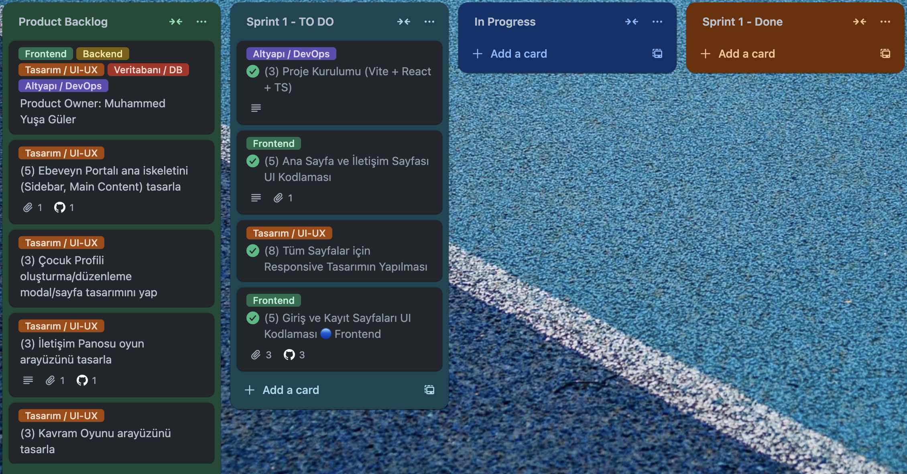
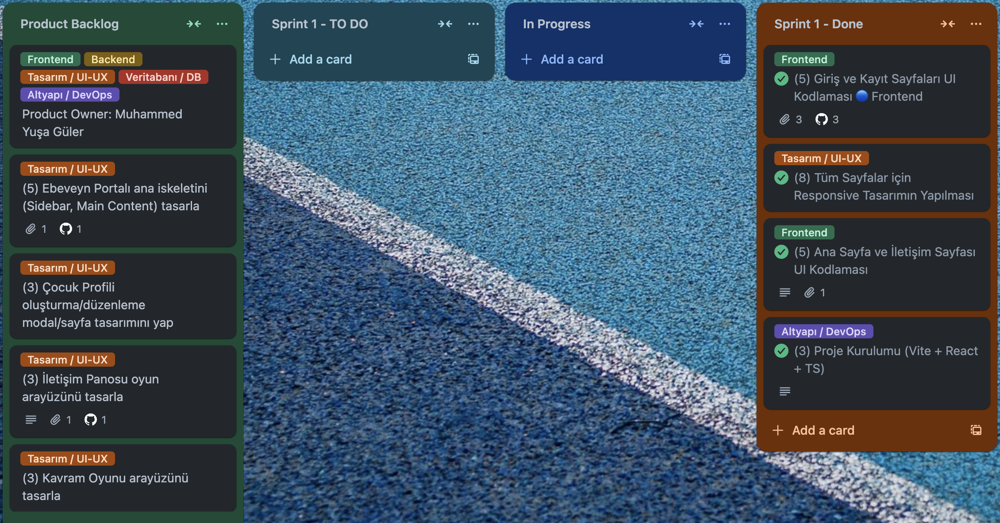

# **SaySay**

*Çocuğunuzun sesini duyun, gelişimini destekleyin!*

---

## **🏆 Takım Bilgileri**

### **`Grup 206`**

### **👥 Takım Elemanları**

<table>
  <tr>
    <th width="200">İsim</th>
    <th width="150">Rol</th>
    <th width="200">Sosyal Medya</th>
  </tr>
  <tr>
    <td><b>Muhammed Yuşa Güler</b></td>
    <td><kbd style="background-color: #ff6b6b; color: white; padding: 4px 8px; border-radius: 12px; font-size: 12px;">Product Owner</kbd></td>
    <td>
      
      
    </td>
  </tr>
  <tr>
    <td><b>Halil Kıyak</b></td>
    <td><kbd style="background-color: #4ecdc4; color: white; padding: 4px 8px; border-radius: 12px; font-size: 12px;">Scrum Master</kbd></td>
    <td>
      
      
    </td>
  </tr>
  <tr>
    <td><b>Sevde Altunköse</b></td>
    <td><kbd style="background-color: #45b7d1; color: white; padding: 4px 8px; border-radius: 12px; font-size: 12px;">Developer</kbd></td>
    <td>
      
      
    </td>
  </tr>
  <tr>
    <td><b>Eray İnan</b></td>
    <td><kbd style="background-color: #96ceb4; color: white; padding: 4px 8px; border-radius: 12px; font-size: 12px;">Developer</kbd></td>
    <td>
      
      
    </td>
  </tr>
  <tr>
    <td><b>Muhammet Yusuf Aydın</b></td>
    <td><kbd style="background-color: #feca57; color: white; padding: 4px 8px; border-radius: 12px; font-size: 12px;">Developer</kbd></td>
    <td>
      
      
    </td>
  </tr>
</table>

---

## **📱 SaySay Nedir?**

SaySay, özellikle <strong>3-7 yaş aralığında olup, otizm gibi iletişim farklılıkları yaşayan veya dil ve iletişim gelişiminde desteğe ihtiyaç duyan</strong> çocuklara yönelik tasarlanmış, kişiselleştirilebilir bir web platformudur.

Amacımız, ebeveynlerin, bakım verenlerin ve uzmanların (özel eğitimciler, dil terapistleri) rehberliğinde, çocukların kendi hızlarında ve ilgi alanlarına göre gelişebilecekleri güvenli ve etkileşimli bir ortam sunmaktır. Platformumuz, çocuğunuzun öğrenme ve iletişim sürecini somut verilerle yönetmenizi ve aranızda daha güçlü bir iletişim köprüsü kurmanızı sağlar.

---

## **🚀 Temel Özellikler**

### ✨ **Ana Özellikler**

#### 🎮 **Kişiselleştirilmiş Kavram Oyunları**

"Büyük/küçük", "renkler" gibi temel kavramları, çocuğunuzun ilgi alanlarına (korsanlar, uzay vb.) göre dinamik olarak şekillenen eğlenceli ve etkileşimli oyunlarla öğretir.

#### 🤖 **AI Destekli Öğrenme**

Gemini API ile kişiselleştirilmiş öğrenme deneyimi ve akıllı içerik önerileri.

#### 🔒 **Ebeveyn Kontrol Paneli**

Tüm oyun ve iletişim ayarlarını yönetebileceğiniz, çocuğunuzun gelişimini somut veriler ve grafiklerle takip edebileceğiniz merkezi kontrol paneli.

### 📋 **Gelecek Planları**
- 📚 Eğitim Kaynakları Kütüphanesi
- ⏱️ Zaman Yönetimi Sistemi
- 🎯 Akıllı Değerlendirme Araçları

---

## **🛠️ Teknoloji Stack**

<h4>Frontend</h4>

Next.js, React, TypeScript

<h4>Backend</h4>

FastAPI, Python

<h4>Veritabanı</h4>

Supabase PostgreSQL

<h4>AI</h4>

Gemini API

<h4>Deployment</h4>

Vercel

---

<h3>🏃‍♂️ Sprint 1</h3>

### **📊 Sprint Bilgileri**
- **Sprint Notları**: Sprint 1'in ana hedefi, projenin temel altyapısını kurmak, teknoloji yığınını hayata geçirmek ve kullanıcıların sistemle etkileşime girebileceği en temel yapıları oluşturmaktı. Vite ile React + TypeScript projesi kuruldu, temel sayfa yapısı oluşturuldu ve responsive tasarım tamamlandı. Veritabanı için Supabase test edildi ve başarılı sonuçlar alındı. Bir sonraki sprint için Next.js'e geçiş kararı alındı.
- **Sprint içinde tamamlanması tahmin edilen puan**: <kbd style="background-color: #28a745; color: white; padding: 4px 8px; border-radius: 12px;">21 Puan</kbd>
- **Puan tamamlama mantığı**: Fibonacci serisi (1, 2, 3, 5, 8) kullanılarak story point'ler belirlenmiştir. Puanlama, işin karmaşıklığı, gerektirdiği efor ve barındırdığı belirsizlik üçgenine göre yapılmıştır. Basit görevler 1-3, orta karmaşıklık 5-8 puan olarak değerlendirilmiştir.
- **Backlog düzeni ve Story seçimleri**: Product Backlog Trello'da yönetilmekte olup, Sprint 1 için temel UI/UX tasarımları ve proje altyapısı önceliklendirilmiştir.
- **Daily Scrum**: WhatsApp üzerinden günlük 20 dakikalık toplantılar yapılmıştır. Takım üyeleri günlük ilerlemelerini paylaşmış, engelleri belirtmiş ve bir sonraki günün planlarını yapmıştır.

### **📈 Sprint Board**

<h4>📈 Sprint Board Görselleri</h4>

### **💻 Uygulama Ekran Görüntüleri**

<table style="width: 100%; border-collapse: collapse;">
  <tr>
    <td colspan="4" style="text-align: center; background-color: #007bff; color: white; padding: 10px;"><h3>💻 Uygulama Ekran Görüntüleri</h3></td>
  </tr>
  <tr>
    <td style="width: 50%; padding: 10px;"></td>
    <td style="width: 50%; padding: 10px;"></td>
  </tr>
  <tr>
    <td style="width: 50%; padding: 10px;"></td>
    <td style="width: 50%; padding: 10px;"></td>
  </tr>
</table>

### **📝 Sprint Review & Retrospective**

#### **Sprint Review**
**Neler Başarıldı ve Gösterildi?**
✅ Proje Kurulumu (Vite + React + TS) - 3 puan
✅ Ana Sayfa ve İletişim Sayfası UI Kodlaması - 5 puan  
✅ Giriş ve Kayıt Sayfaları UI Kodlaması - 5 puan
✅ Tüm Sayfalar için Responsive Tasarım - 8 puan
✅ Proje klasör yapısı organize edildi (components, pages, styles, utils, hooks, types).
✅ Veritabanı için Supabase test edildi ve başarılı sonuçlar alındı.

**Tespit Edilen Sorunlar:**
⚠️ Planlanan tasarıma göre ufak tasarım sorunları mevcut.

**Sprint Review katılımcıları**: Muhammed Yuşa Güler, Halil Kıyak, Sevde Altunköse, Eray İnan, Muhammet Yusuf Aydın

#### **Sprint Retrospective**
**Neler İyi Gitti?**
- Takım içi iletişim ve iş birliği çok güçlüydü.
- Vite kullanma kararımız, geliştirme sürecini hızlandırdı.
- Responsive tasarım başarıyla tamamlandı.
- Teknoloji stack kararlarında esneklik gösterdik (Vite'dan Next.js'e geçiş planı).

**Neler Geliştirilebilir?**
- Bazı görevlerin karmaşıklığını başlangıçta tam olarak kestiremedik.
- Bir sonraki sprint için kavram oyunları ve kullanıcı yönetimi özellikleri önceliklendirilmiştir.

---

