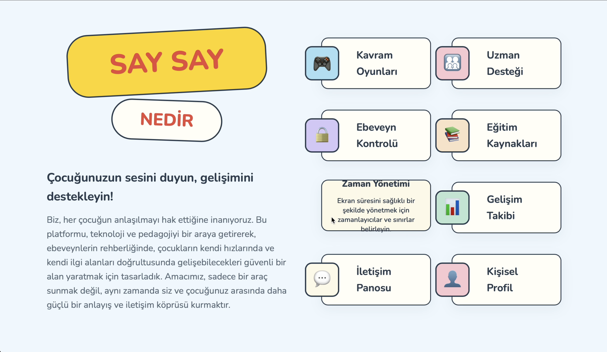
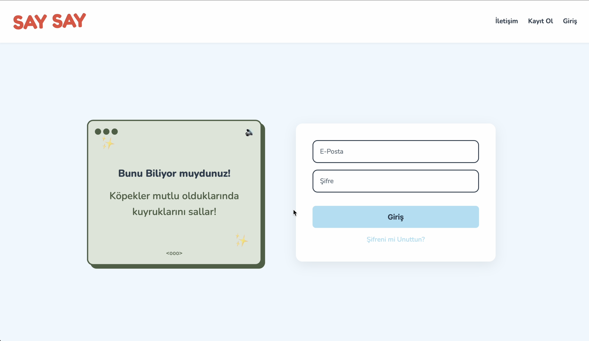
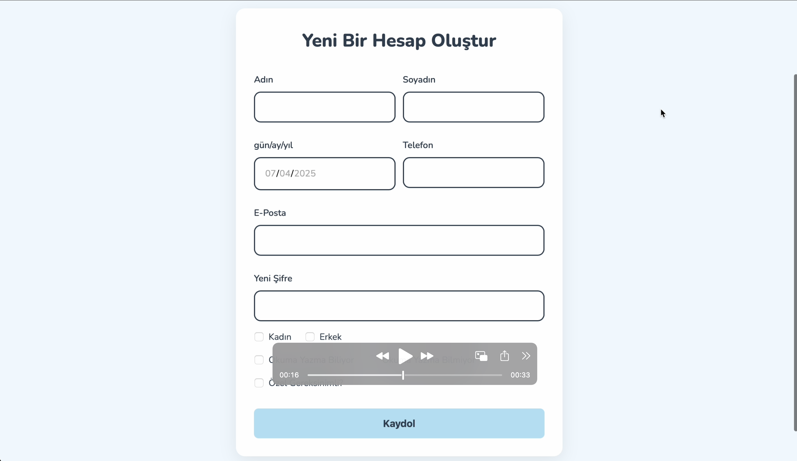
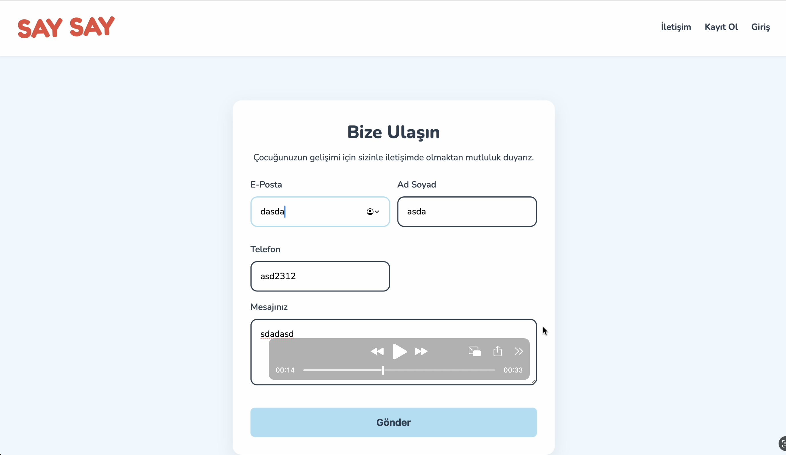

# **SaySay**

*Çocuğunuzun sesini duyun, gelişimini destekleyin!*

---

## **🏆 Takım Bilgileri**

### **`Grup 206`**

### **👥 Takım Elemanları**

| İsim | Rol | Sosyal Medya |
|------|-----|--------------|
| Muhammed Yuşa Güler | Product Owner |   |
| Halil Kıyak | Scrum Master |   |
| Sevde Altunköse | Developer |   |
| Eray İnan | Developer |   |
| Muhammet Yusuf Aydın | Developer |   |

---

## **📱 SaySay Nedir?**

SaySay, özellikle **3-7 yaş aralığında olup, otizm gibi iletişim farklılıkları yaşayan veya dil ve iletişim gelişiminde desteğe ihtiyaç duyan** çocuklara yönelik tasarlanmış, kişiselleştirilebilir bir web platformudur.

Amacımız, ebeveynlerin, bakım verenlerin ve uzmanların (özel eğitimciler, dil terapistleri) rehberliğinde, çocukların kendi hızlarında ve ilgi alanlarına göre gelişebilecekleri güvenli ve etkileşimli bir ortam sunmaktır. Platformumuz, çocuğunuzun öğrenme ve iletişim sürecini somut verilerle yönetmenizi ve aranızda daha güçlü bir iletişim köprüsü kurmanızı sağlar.

---

## **🚀 Temel Özellikler**

### ✨ **Ana Özellikler**

#### 🎮 **Kişiselleştirilmiş Kavram Oyunları**
"Büyük/küçük", "renkler" gibi temel kavramları, çocuğunuzun ilgi alanlarına (korsanlar, uzay vb.) göre dinamik olarak şekillenen eğlenceli ve etkileşimli oyunlarla öğretir.

#### 🤖 **AI Destekli Öğrenme**
Gemini API ile kişiselleştirilmiş öğrenme deneyimi ve akıllı içerik önerileri.

#### 🔒 **Ebeveyn Kontrol Paneli**
Tüm oyun ve iletişim ayarlarını yönetebileceğiniz, çocuğunuzun gelişimini somut veriler ve grafiklerle takip edebileceğiniz merkezi kontrol paneli.

### 📋 **Gelecek Planları**
- 📚 Eğitim Kaynakları Kütüphanesi
- ⏱️ Zaman Yönetimi Sistemi
- 🎯 Akıllı Değerlendirme Araçları

---

## **🛠️ Teknoloji Stack**

| Frontend | Backend | Veritabanı | AI | Deployment |
|----------|---------|------------|----|------------|
| Next.js, React, TypeScript | FastAPI, Python | Supabase PostgreSQL | Gemini | Vercel |

---

<h2>🏃‍♂️ Sprint 1</h2>

### Sprint Notları
Bu sprint'in ana hedefi, projenin temel frontend arayüzlerini kodlayarak görsel bir prototip oluşturmaktı. Hızlı başlangıç için Vite ile React + TypeScript projesi kuruldu ve statik sayfalar (Ana Sayfa, Giriş/Kayıt, İletişim) hayata geçirildi. Tüm bu sayfaların mobil ve masaüstü cihazlarla uyumlu responsive tasarımı tamamlandı. Sprint sonunda, projenin ölçeklenebilirliği için Next.js'e geçiş yapılmasına stratejik olarak karar verildi.

---

### Sprint İçinde Tamamlanması Tahmin Edilen Puan
**Hedeflenen Puan:** 21 Puan  
**Tamamlanan Puan:** 21 Puan

---

### Puan Tamamlama Mantığı
Proje boyunca tamamlanması gereken toplam backlog puanı 131’dir. İlk Sprint için bitirilmesi istenilen puan sayısı 21 olarak belirlenmiştir ve hedefe ulaşılmıştır.

Puanlama, görevlerin karmaşıklığı, gerektirdiği efor ve barındırdığı belirsizliklere göre Fibonacci serisi (1, 2, 3, 5, 8, ...) kullanılarak belirlenmektedir. Bir görev, tüm gereksinimleri karşılayıp "Done" sütununa taşındığında, o göreve atanan puan tamamlanmış sayılır.

---

<h4>Daily Scrum</h4>

Daily Scrum toplantılarında ekip, önceki gün yapılanlar, o günün planı ve karşılaşılan engelleri paylaşmıştır.

Aşağıdaki görselde UI/UX ve uygulama özellikleri üzerine yapılan tartışmadan bir kesit yer almaktadır.

<h4>Sprint Board</h4>

**Sprint Board Linki:** [https://trello.com/b/gMziIBP7/saysay](https://trello.com/b/gMziIBP7/saysay)

<h4>Uygulama Ekran Görüntüleri</h4>

Ana Sayfa  

Giriş  

Kayıt  

İletişim  

<h4>Sprint Review & Retrospective</h4>

<strong>Review (Neler Başarıldı?):</strong>

✅ (3 Puan) Vite ile React + TypeScript projesi başarıyla kuruldu.

✅ (5 Puan) Ana Sayfa ve İletişim Sayfası UI kodlaması tamamlandı.

✅ (5 Puan) Giriş ve Kayıt Sayfaları UI kodlaması tamamlandı.

✅ (8 Puan) Tüm sayfalar için responsive tasarım yapıldı.

<strong>Retrospective (Neler Öğrendik?):</strong>

Takım içi iletişim ve Vite kullanarak hızlı başlangıç yapmamız çok iyi gitti.

Bazı UI görevlerinin tahminimizden uzun sürdüğünü fark ettik. Bir sonraki sprint için daha dikkatli planlama yapma kararı aldık.

