

# **SaySay**

**🌐 Canlı Demo:** [https://say-say.vercel.app/](https://say-say.vercel.app/)

SaySay, çocukların kavram öğrenimini destekleyen interaktif bir platformdur. Ebeveynler çocuklarının gelişimini takip edebilir, çocuklar ise eğlenceli oyunlar ile öğrenir.

*Çocuğunuzun sesini duyun, gelişimini destekleyin!*

---

## **🏆 Takım Bilgileri**

### **`Grup 206`**

### **👥 Takım Elemanları**

| İsim | Rol | Sosyal Medya |
|------|-----|--------------|
| Muhammed Yuşa Güler | Product Owner |   |
| Halil Kıyak | Scrum Master |   |
| Sevde Altunköse | Developer |   |
| Eray İnan | Developer |   |
| Muhammet Yusuf Aydın | Developer |   |

---

## **📱 SaySay Nedir?**

SaySay, özellikle **3-7 yaş aralığında olup, otizm gibi iletişim farklılıkları yaşayan veya dil ve iletişim gelişiminde desteğe ihtiyaç duyan** çocuklara yönelik tasarlanmış, kişiselleştirilebilir bir web platformudur.

Amacımız, ebeveynlerin, bakım verenlerin ve uzmanların (özel eğitimciler, dil terapistleri) rehberliğinde, çocukların kendi hızlarında ve ilgi alanlarına göre gelişebilecekleri güvenli ve etkileşimli bir ortam sunmaktır. Platformumuz, çocuğunuzun öğrenme ve iletişim sürecini somut verilerle yönetmenizi ve aranızda daha güçlü bir iletişim köprüsü kurmanızı sağlar.

---

## **🚀 Temel Özellikler**

### ✨ **Ana Özellikler**

#### 🎮 **Kişiselleştirilmiş Kavram Oyunları**
"Büyük/küçük", "renkler" gibi temel kavramları, çocuğunuzun ilgi alanlarına (korsanlar, uzay vb.) göre dinamik olarak şekillenen eğlenceli ve etkileşimli oyunlarla öğretir.

#### 🤖 **AI Destekli Öğrenme**
Gemini API ile kişiselleştirilmiş öğrenme deneyimi ve akıllı içerik önerileri.

#### 🔒 **Ebeveyn Kontrol Paneli**
Tüm oyun ve iletişim ayarlarını yönetebileceğiniz, çocuğunuzun gelişimini somut veriler ve grafiklerle takip edebileceğiniz merkezi kontrol paneli.

### 📋 **Gelecek Planları**
- 📚 Eğitim Kaynakları Kütüphanesi
- ⏱️ Zaman Yönetimi Sistemi
- 🎯 Akıllı Değerlendirme Araçları

---

## **🛠️ Teknoloji Stack**

| Frontend | Backend | Veritabanı | AI | Deployment |
|----------|---------|------------|----|------------|
| Next.js, React, TypeScript | FastAPI, Python | Supabase PostgreSQL | Gemini | Vercel |

---

<h2>🏃‍♂️ Sprint 1</h2>

### Sprint Notları
Bu sprint'in ana hedefi, projenin temel frontend arayüzlerini kodlayarak görsel bir prototip oluşturmaktı. Hızlı başlangıç için Vite ile React + TypeScript projesi kuruldu ve statik sayfalar (Ana Sayfa, Giriş/Kayıt, İletişim) hayata geçirildi. Tüm bu sayfaların mobil ve masaüstü cihazlarla uyumlu responsive tasarımı tamamlandı. Sprint sonunda, projenin ölçeklenebilirliği için Next.js'e geçiş yapılmasına stratejik olarak karar verildi.

---

### Sprint İçinde Tamamlanması Tahmin Edilen Puan
**Hedeflenen Puan:** 21 Puan  
**Tamamlanan Puan:** 21 Puan

---

### Puan Tamamlama Mantığı
Proje boyunca tamamlanması gereken toplam backlog puanı 131’dir. İlk Sprint için bitirilmesi istenilen puan sayısı 21 olarak belirlenmiştir ve hedefe ulaşılmıştır.

Puanlama, görevlerin karmaşıklığı, gerektirdiği efor ve barındırdığı belirsizliklere göre Fibonacci serisi (1, 2, 3, 5, 8, ...) kullanılarak belirlenmektedir. Bir görev, tüm gereksinimleri karşılayıp "Done" sütununa taşındığında, o göreve atanan puan tamamlanmış sayılır.

---

<h4>Daily Scrum</h4>

Daily Scrum toplantılarında ekip, önceki gün yapılanlar, o günün planı ve karşılaşılan engelleri paylaşmıştır.

Aşağıdaki görselde UI/UX ve uygulama özellikleri üzerine yapılan tartışmadan bir kesit yer almaktadır.

<h4>Sprint Board</h4>

**Sprint Board Linki:** [https://trello.com/b/gMziIBP7/saysay](https://trello.com/b/gMziIBP7/saysay)

<h4>Uygulama Ekran Görüntüleri</h4>

| Ana Sayfa | Giriş | Kayıt | İletişim |
|-----------|-------|-------|----------|
| 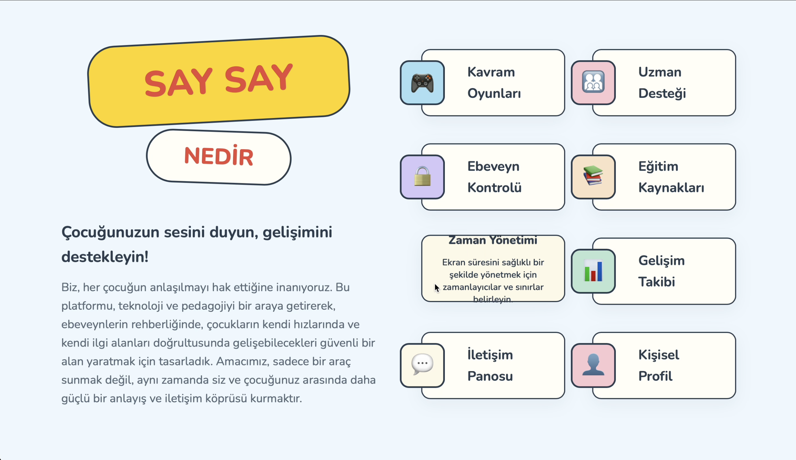 | 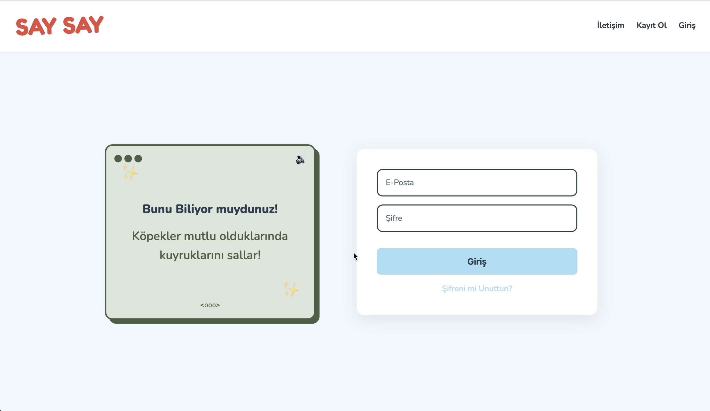 | 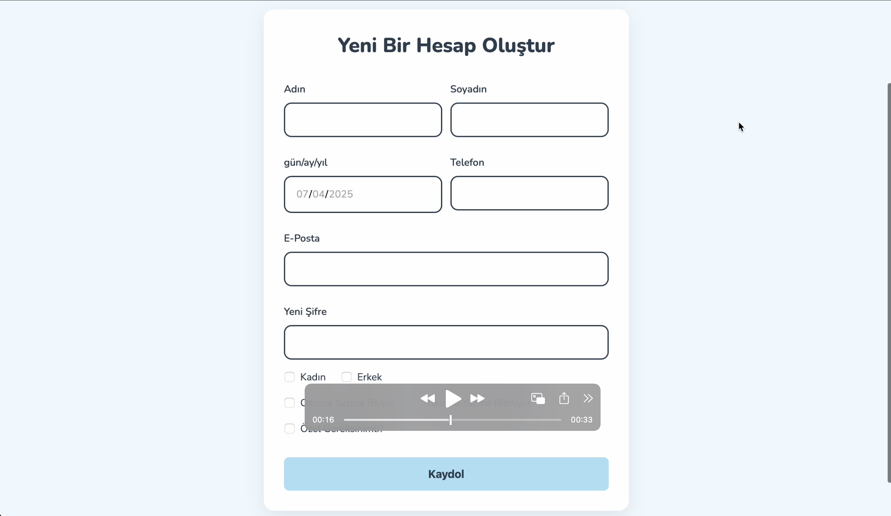 | 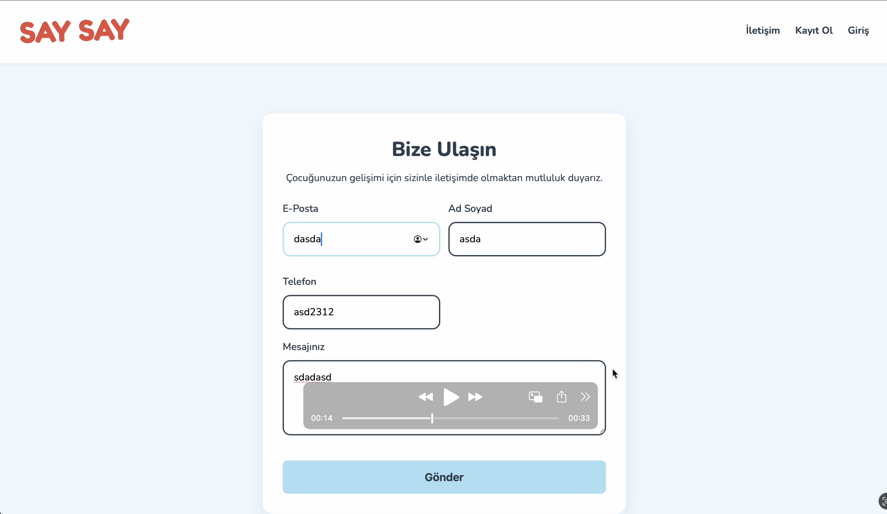 |

<h4>Sprint Review</h4>

<strong>Review (Neler Başarıldı?):</strong>

✅ (3 Puan) Vite ile React + TypeScript projesi başarıyla kuruldu.

✅ (5 Puan) Ana Sayfa ve İletişim Sayfası UI kodlaması tamamlandı.

✅ (5 Puan) Giriş ve Kayıt Sayfaları UI kodlaması tamamlandı.

✅ (8 Puan) Tüm sayfalar için responsive tasarım yapıldı.

<h4>Sprint Retrospective</h4>

<strong>Retrospective (Neler Öğrendik?):</strong>

Takım içi iletişim ve Vite kullanarak hızlı başlangıç yapmamız çok iyi gitti.

Bazı UI görevlerinin tahminimizden uzun sürdüğünü fark ettik. Bir sonraki sprint için daha dikkatli planlama yapma kararı aldık.

<h2>🏃‍♂️ Sprint 2</h2>

**🌐 Sprint 2 Canlı Demo:** [https://say-say.vercel.app/](https://say-say.vercel.app/)

### Sprint Notları
Bu sprint'in ana hedefi, Next.js 15'e geçiş yaparak modern folder structure oluşturmak ve temel portal özelliklerini geliştirmekti. Supabase entegrasyonu ile veritabanı bağlantısı kuruldu, çocuk ekleme modalı ve profil yönetimi tamamlandı. Kavram oyunları için temel altyapı hazırlandı ve kullanıcı deneyimi iyileştirmeleri yapıldı.

**Teknik Geliştirmeler:**
- Next.js 15'e başarılı geçiş yapıldı ve modern App Router yapısı benimsendi
- Supabase PostgreSQL veritabanı entegrasyonu tamamlandı
- Authentication sistemi (login, register, forgot-password, reset-password) geliştirildi
- Responsive tasarım ve mobil uyumluluk iyileştirildi
- Component-based mimari ile yeniden kullanılabilir bileşenler oluşturuldu

**Portal Özellikleri:**
- Çocuk ekleme ve profil yönetimi modalı geliştirildi
- Portal ana sayfası ve sidebar navigasyonu tamamlandı
- Çocuk listesi ve detay sayfaları oluşturuldu
- Kavram oyunları için temel altyapı hazırlandı
- Roadmap sistemi ve kavram takibi implementasyonu başlatıldı

**UI/UX İyileştirmeleri:**
- LoadingScreen reusable component oluşturuldu
- Avatar component SVG desteği eklendi
- Portal children horizontal layout düzenlendi
- Global UI/UX iyileştirmeleri yapıldı
- Responsive tasarım optimizasyonları tamamlandı

**Süreç Değişiklikleri:**
- Sprint Board için Notion'a geçiş yapıldı. Tüm ekip üyeleri, Notion'un kullanım kolaylığı ve aşinalığı nedeniyle bu değişikliği oybirliğiyle kabul etti.
- Git workflow ve environment setup süreçleri standardize edildi
- Code cleanup ve dead comment temizliği yapıldı

---

### Sprint İçinde Tamamlanması Tahmin Edilen Puan
**Hedeflenen Puan:** 73 Puan  
**Tamamlanan Puan:** 55 Puan

---

### Puan Tamamlama Mantığı
Sprint 2 için toplam 73 puan hedeflenmiş, 55 puan tamamlanmıştır. Kalan 18 puan Sprint 3'e aktarılmıştır. Puanlama, görevlerin karmaşıklığı, gerektirdiği efor ve barındırdığı belirsizliklere göre Fibonacci serisi (1, 2, 3, 5, 8, ...) kullanılarak belirlenmektedir.

---

<h4>Daily Scrum</h4>

Daily Scrum toplantılarında ekip, önceki gün yapılanlar, o günün planı ve karşılaşılan engelleri paylaşmıştır.

Aşağıdaki görsellerde Sprint 2 sürecinde yapılan toplantılardan kesitler yer almaktadır. Özellikle görsel oluşturma teknolojileri üzerine yapılan tartışmalar ve Google Cloud Vertex AI'nin projemiz için değerlendirilmesi konuları ele alınmıştır. Ücretsiz kredi ile üye olma süreci ve AI entegrasyonu planları detaylandırılmıştır.

**Toplantı 1:** Görsel oluşturma teknolojileri ve AI entegrasyonu planları

**Toplantı 2:** Google Cloud Vertex AI değerlendirmesi ve ücretsiz kredi süreci

**Toplantı 3:** AI entegrasyonu teknik detayları ve implementasyon planları

<h4>Sprint Board</h4>

  
  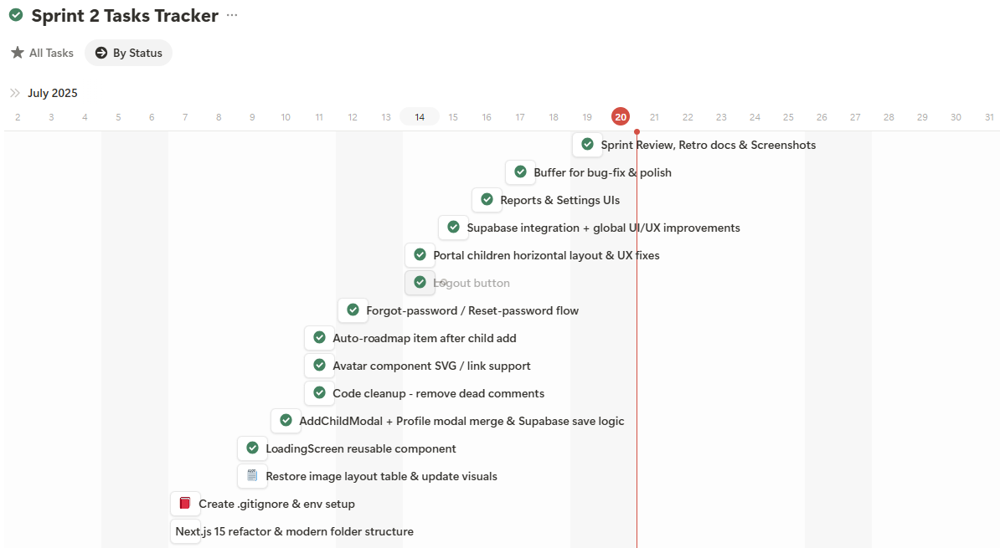
  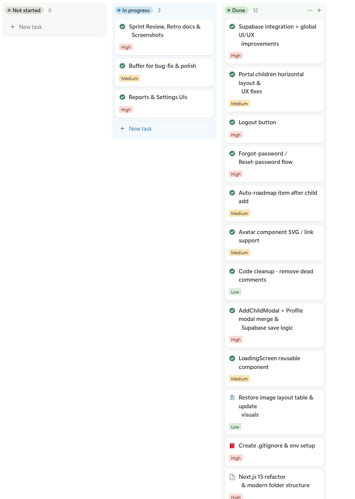

<h4>Uygulama Ekran Görüntüleri</h4>

| Ana Sayfa | Giriş | Kayıt | Portal |
|-----------|-------|-------|--------|
| 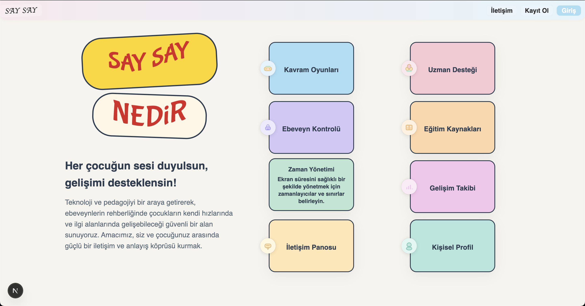 | 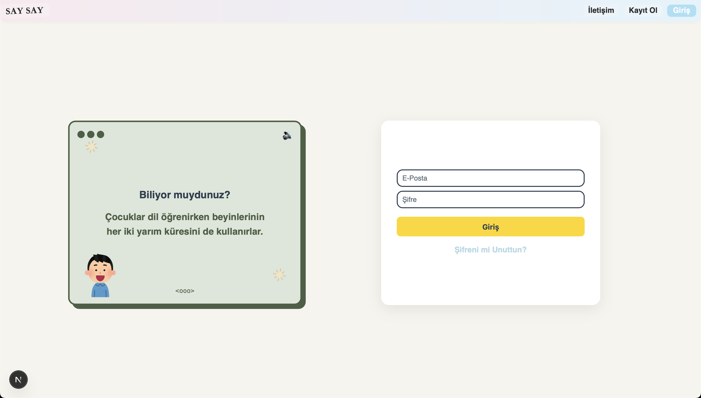 | 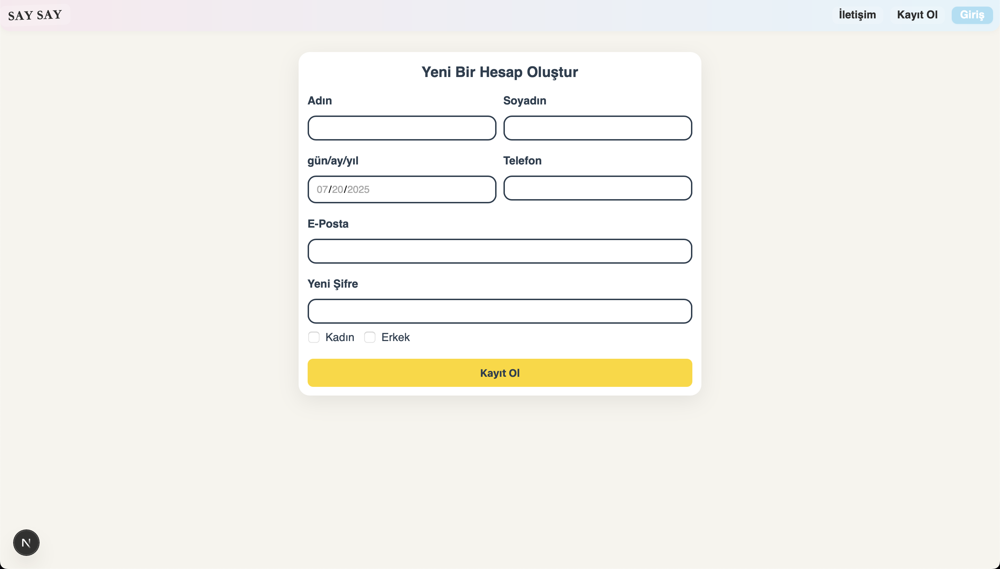 | 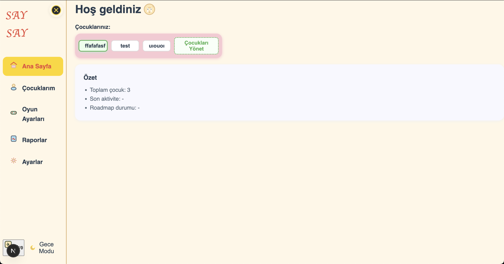 |

| Çocuklar | Oyunlar | Raporlar | Ayarlar |
|----------|---------|----------|---------|
| 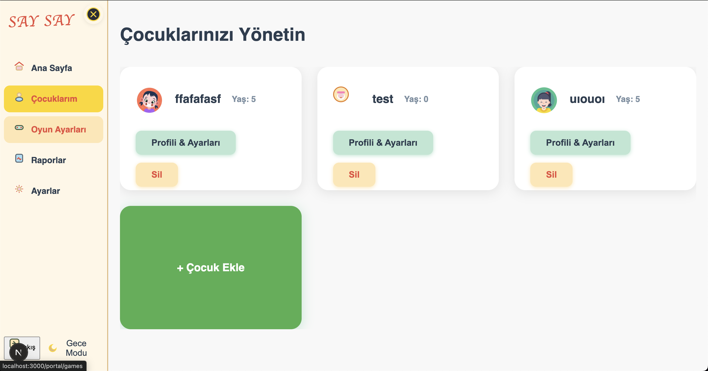 | 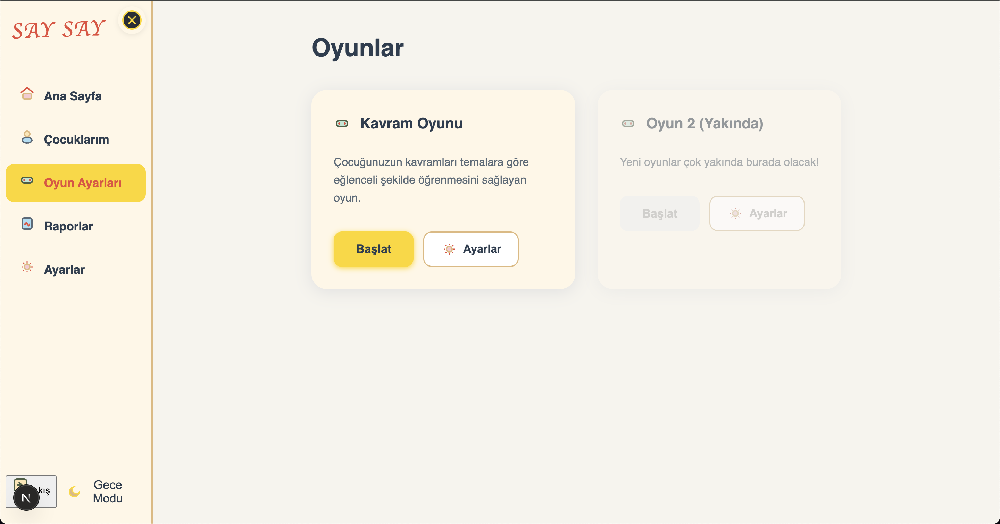 | 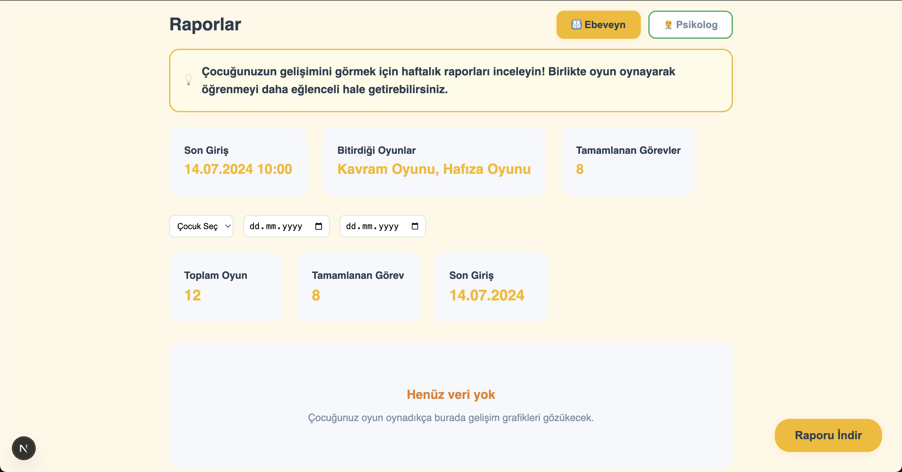 | 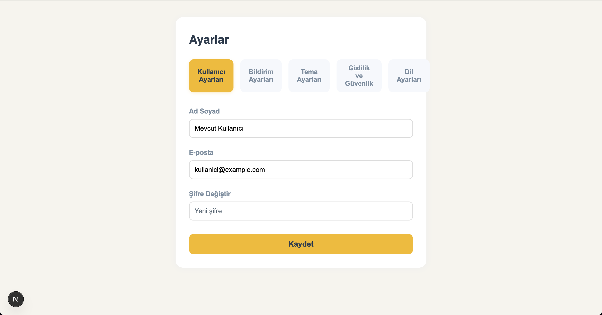 |

<h4>Sprint Review</h4>

<strong>Review (Neler Başarıldı?):</strong>

**✅ Teknik Başarılar:**
- Next.js 15'e sorunsuz geçiş yapıldı ve App Router yapısı tam olarak benimsendi
- Supabase PostgreSQL entegrasyonu başarıyla tamamlandı, authentication sistemi çalışır durumda
- Component-based mimari ile LoadingScreen, Avatar, PortalSidebar gibi yeniden kullanılabilir bileşenler oluşturuldu
- Responsive tasarım tüm ekran boyutlarında test edildi ve optimize edildi

**✅ Portal Özellikleri:**
- Çocuk ekleme modalı ve profil yönetimi tamamen fonksiyonel hale getirildi
- Portal ana sayfası ve sidebar navigasyonu kullanıcı dostu şekilde tasarlandı
- Çocuk listesi ve detay sayfaları Supabase ile entegre edildi
- Kavram oyunları için temel altyapı hazırlandı (oyun1 sayfası oluşturuldu)
- Roadmap sistemi için veritabanı yapısı kuruldu

**✅ UI/UX İyileştirmeleri:**
- LoadingScreen component'i tüm sayfalarda tutarlı şekilde kullanılıyor
- Avatar component'i SVG desteği ile esnek hale getirildi
- Portal children horizontal layout ile daha iyi kullanıcı deneyimi sağlandı
- Global UI/UX iyileştirmeleri ile tutarlı tasarım dili oluşturuldu

**✅ Süreç İyileştirmeleri:**
- Notion'a geçiş ile ekip içi iletişim ve görev takibi kolaylaştı
- Git workflow standardize edildi ve environment setup süreçleri otomatikleştirildi
- Code cleanup ile kod kalitesi artırıldı ve maintainability iyileştirildi

<h4>Sprint Retrospective</h4>

<strong>Retrospective (Neler Öğrendik?):</strong>

**🎯 Pozitif Deneyimler:**
- Next.js 15'e geçiş süreci beklenenden daha sorunsuz oldu, modern development practices başarıyla benimsendi
- Supabase entegrasyonu ile backend altyapısı güçlendirildi ve authentication sistemi güvenilir şekilde çalışıyor
- Component-based yaklaşım ile kod tekrarı azaldı ve geliştirme hızı arttı
- Takım içi iletişim ve görev dağılımı daha etkili hale geldi, herkes kendi alanında uzmanlaştı

**⚠️ Gelişim Alanları:**
- Bazı görevlerin tahminimizden uzun sürdüğünü fark ettik (özellikle UI/UX iyileştirmeleri)
- Supabase ile ilgili bazı edge case'lerde zaman kaybı yaşandı
- Kavram oyunları altyapısı için daha detaylı planlama gerekli
- Test süreçleri için daha sistematik yaklaşım benimsenmeli

**📋 Gelecek Sprint İçin Alınan Kararlar:**
- Sprint 3'te daha gerçekçi puanlama yapılacak ve buffer süreleri artırılacak
- Kavram oyunları için detaylı teknik planlama yapılacak
- Test süreçleri için otomatik test yazımı başlatılacak
- Performance optimizasyonları için monitoring araçları entegre edilecek
- Code review süreçleri daha sıkı hale getirilecek

**🚀 Teknik Öğrenilenler:**
- Next.js App Router'ın avantajları ve best practices
- Supabase RLS (Row Level Security) implementasyonu
- Component-based mimarinin önemi ve reusability
- Responsive tasarım için modern CSS teknikleri
- Git workflow ve environment management best practices

<h2>🏃‍♂️ Sprint 3</h2>

**🌐 Sprint 3 Canlı Demo:** [https://say-say.vercel.app/](https://say-say.vercel.app/)

### Sprint Notları
Bu sprint'in ana hedefi, AI entegrasyonu ve kavram oyunlarının geliştirilmesi olacaktır. Gemini API entegrasyonu ile kişiselleştirilmiş öğrenme deneyimi sağlanacak ve kavram oyunları için gelişmiş algoritmalar implement edilecektir. Ayrıca backend altyapısının güçlendirilmesi ve performans optimizasyonları da bu sprint'in kapsamında yer almaktadır.

**AI Entegrasyonu:**
- Gemini API entegrasyonu ve kişiselleştirilmiş içerik üretimi
- AI destekli soru-cevap sistemi ve öğrenme analizi
- Akıllı içerik önerileri ve adaptif öğrenme algoritmaları
- Text-to-Speech (TTS) entegrasyonu ile sesli öğrenme desteği
- AI destekli görsel içerik üretimi ve kavram görselleri

**Kavram Oyunları Geliştirmeleri:**
- Gelişmiş oyun algoritmaları ve zorluk seviyeleri
- Çoklu kavram desteği ve kategorize edilmiş içerik
- Oyun istatistikleri ve ilerleme takibi
- Çocuk dostu oyun arayüzleri ve animasyonlar
- Oyun sonuçları ve başarı rozetleri sistemi

**Backend İyileştirmeleri:**
- FastAPI backend geliştirmesi ve API optimizasyonu
- Veritabanı performans iyileştirmeleri
- Güvenlik ve authentication güçlendirmeleri
- Docker containerization ve deployment optimizasyonu
- API rate limiting ve caching mekanizmaları

**UI/UX Geliştirmeleri:**
- Oyun arayüzlerinin iyileştirilmesi
- Responsive tasarım optimizasyonları
- Kullanıcı deneyimi iyileştirmeleri
- Çocuk dostu renk paleti ve tipografi
- Erişilebilirlik (accessibility) iyileştirmeleri

**Performans ve Güvenlik:**
- Frontend performans optimizasyonları
- Backend API response time iyileştirmeleri
- Güvenlik audit ve vulnerability scanning
- Data encryption ve privacy compliance
- Error handling ve logging sistemi

---

### Sprint İçinde Tamamlanması Tahmin Edilen Puan
**Hedeflenen Puan:** 164 Puan  
**Tamamlanan Puan:** 150 Puan

---

### Puan Tamamlama Mantığı
Sprint 3 için toplam 164 puan hedeflenmiştir. Bu sprint'te AI entegrasyonu, kavram oyunları geliştirmeleri ve backend iyileştirmeleri odak noktası olacaktır. Puanlama, görevlerin karmaşıklığı, gerektirdiği efor ve barındırdığı belirsizliklere göre Fibonacci serisi (1, 2, 3, 5, 8, ...) kullanılarak belirlenmektedir.

**Öncelikli Görevler:**
- AI API entegrasyonu (8 puan)
- Kavram oyunları geliştirme (8 puan)
- Backend API optimizasyonu (5 puan)
- UI/UX iyileştirmeleri (5 puan)
- Test ve güvenlik (3 puan)
- Dokümantasyon (2 puan)

---

<h4>Daily Scrum</h4>

Daily Scrum toplantılarında ekip, önceki gün yapılanlar, o günün planı ve karşılaşılan engelleri paylaşmıştır.

Bu sprint'te AI entegrasyonu ve kavram oyunları geliştirmeleri üzerine odaklanılacaktır. Ekip üyeleri, Gemini API entegrasyonu ve oyun algoritmaları konularında işbirliği yapacaktır.

**Ekip Dağılımı:**
- **AI Entegrasyonu:** Muhammed Yuşa Güler, Halil Kıyak
- **Kavram Oyunları:** Sevde Altunköse, Muhammet Yusuf Aydın
- **Backend & DevOps:** Halil Kıyak

**Haftalık Hedefler:**
- **Hafta 1:** AI API entegrasyonu ve temel backend altyapısı
- **Hafta 2:** Kavram oyunları geliştirme ve UI iyileştirmeleri
- **Hafta 3:** Test, optimizasyon ve deployment

**Toplantı 1:** AI entegrasyonu ve kavram oyunları planlaması

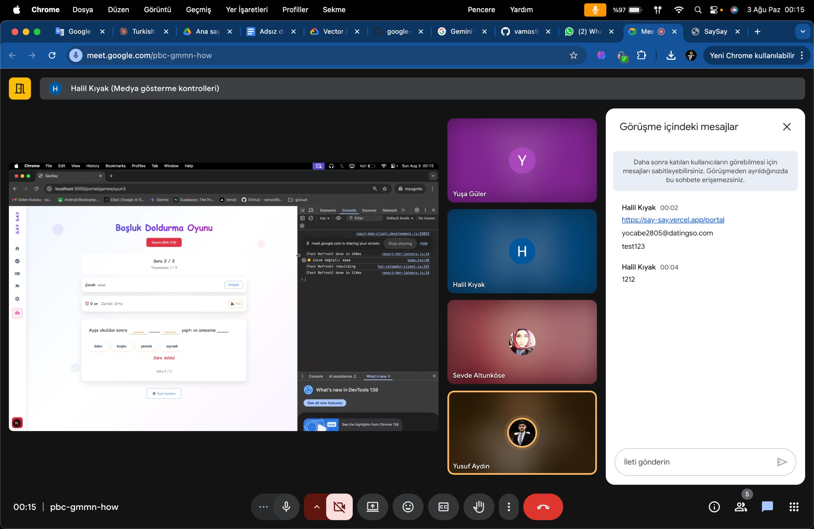

**Toplantı 2:** Teknik implementasyon detayları ve API entegrasyonu

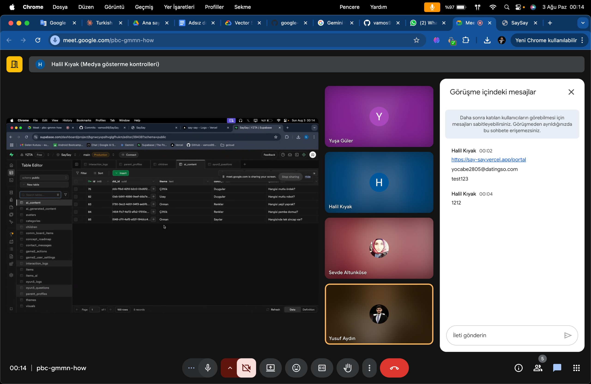

**Toplantı 3:** Sprint progress review ve gelecek hedefler

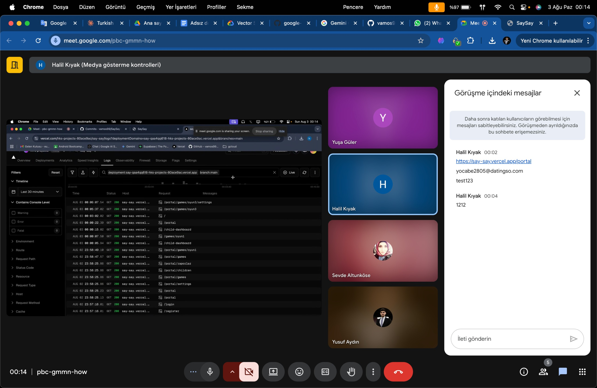

<h4>Sprint Board</h4>

Sprint 3 board'u Notion'da yönetilmektedir. Ekip üyeleri, görev takibi ve ilerleme raporları için Notion platformunu kullanmaya devam etmektedir.

**Board Kategorileri:**
- 📋 **To Do:** Henüz başlanmamış görevler
- 🔄 **In Progress:** Aktif olarak geliştirilen özellikler
- 🧪 **Testing:** Test aşamasında olan özellikler
- ✅ **Done:** Tamamlanan görevler
- 🚫 **Blocked:** Engellenen görevler

**Önemli Metrikler:**
- Sprint Velocity: 37 puan hedef
- Burndown Chart: Günlük ilerleme takibi
- Team Capacity: Haftalık kapasite planlaması

**Sprint Board 1:** Sprint 3 görev planlaması ve sprint board yapısı

**Sprint Board 2:** Sprint 3 detaylı görev dağılımı ve progress tracking

<h4>Uygulama Ekran Görüntüleri</h4>

**Portal Ana Sayfa:** Gelişmiş portal dashboard'u ve çocuk seçimi

**Çocuk Profili:** Çocuk detay sayfası ve profil yönetimi

**Oyun Seçimi:** Kavram oyunları menüsü ve oyun kategorileri

**Oyun 1:** İlk kavram oyunu arayüzü ve oyun mekanikleri

**Oyun 2:** İkinci kavram oyunu ve gelişmiş oyun arayüzü

**Oyun 3:** Üçüncü kavram oyunu ve AI destekli içerik

**Oyun Ayarları:** Oyun konfigürasyonu ve zorluk seviyeleri

**Oyun Sonucu:** Oyun tamamlama ve başarı ekranı

**İlerleme Takibi:** Çocuk gelişim raporu ve istatistikler

**Raporlar:** Detaylı gelişim raporları ve grafikler

**Ayarlar:** Portal ayarları ve kullanıcı tercihleri

**Roadmap:** Çocuk gelişim yol haritası ve kavram takibi

<h4>Sprint Review</h4>

<strong>Review (Neler Başarıldı?):</strong>

Sprint 3 henüz başlamıştır. Review bilgileri sprint tamamlandığında güncellenecektir.

**Beklenen Başarılar:**
- AI entegrasyonu ile kişiselleştirilmiş öğrenme deneyimi
- Gelişmiş kavram oyunları ve eğitici içerikler
- Optimize edilmiş backend performansı
- Kullanıcı dostu ve erişilebilir arayüzler

<h4>Sprint Retrospective</h4>

<strong>Retrospective (Neler Öğrendik?):</strong>

Sprint 3 henüz başlamıştır. Retrospective bilgileri sprint tamamlandığında güncellenecektir.

**Beklenen Öğrenmeler:**
- AI API entegrasyonu best practices
- Oyun geliştirme metodolojileri
- Performance optimization teknikleri
- Team collaboration ve communication iyileştirmeleri

