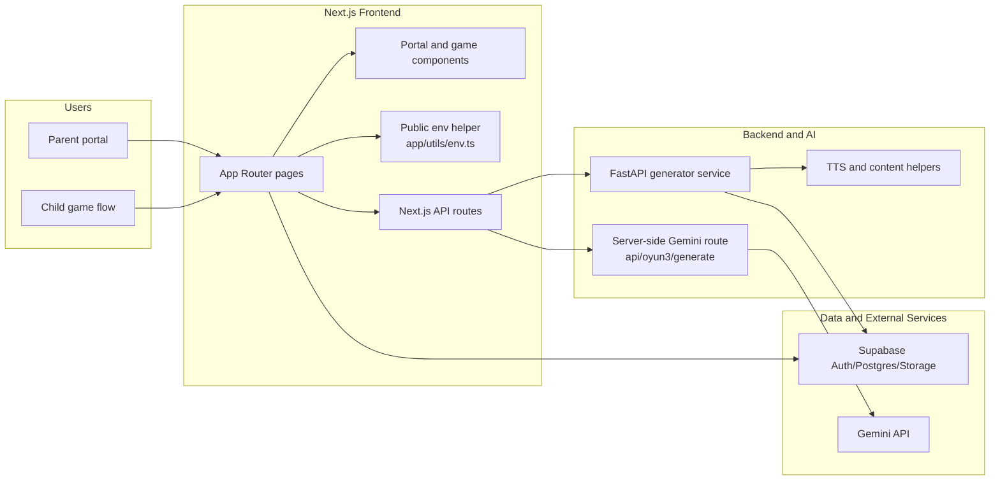
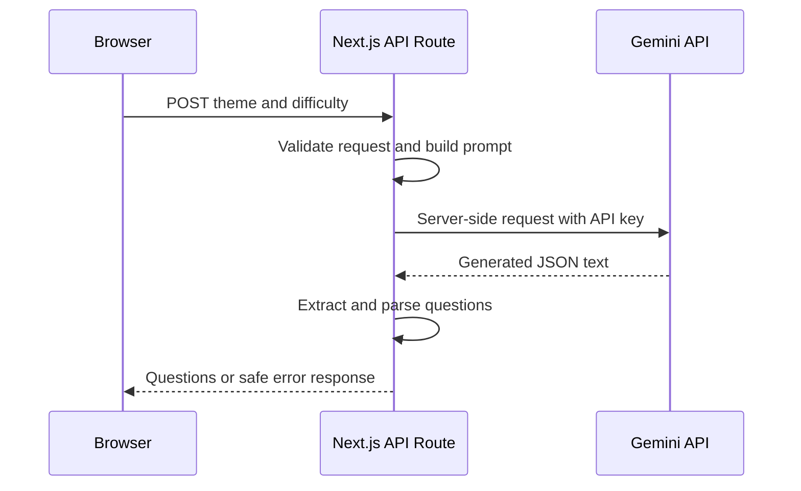

# Project Architecture

Bu doküman, SaySay reposunun portfolio açısından teknik olarak ne gösterdiğini kısa ve görsel şekilde açıklar. Proje bir bootcamp takım projesidir; bu nedenle ana hedef üretim seviyesi iddia kurmak değil, mevcut ürün akışını daha okunabilir, güvenli ve sürdürülebilir gösterebilmektir.

## Product and Service Flow

## Secure Content Generation Flow

## What Is Already Done

| Area | Completed work | Files |
| --- | --- | --- |
| Product structure | Parent portal, child dashboard and game pages are organized under the Next.js App Router | `frontend/app/` |
| Server-side AI route | Oyun3 Gemini request runs through a Next.js API route instead of exposing the API key to the browser | `frontend/app/api/oyun3/generate/route.ts` |
| Env hygiene | Public env access and backend URL defaults are centralized; examples document required values | `frontend/app/utils/env.ts`, `frontend/.env.example`, `backend/generator/config.env.example` |
| Backend generator | FastAPI/Python service keeps AI content, TTS, image and Supabase helper code separate from UI code | `backend/generator/` |
| Deployment handoff | Vercel public demo is documented as disabled until a new hosting decision is made | `docs/deployment-handoff.md` |
| CI and checks | GitHub Actions typechecks the frontend and compiles backend Python files | `.github/workflows/ci.yml` |

## Realistic Next Backlog

| Priority | Work | Why it matters |
| --- | --- | --- |
| P2 | Env-missing user states | Shows clear UI messages when local Supabase/Gemini config is absent instead of failing silently. |
